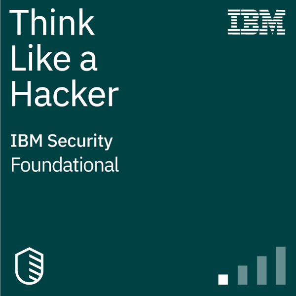
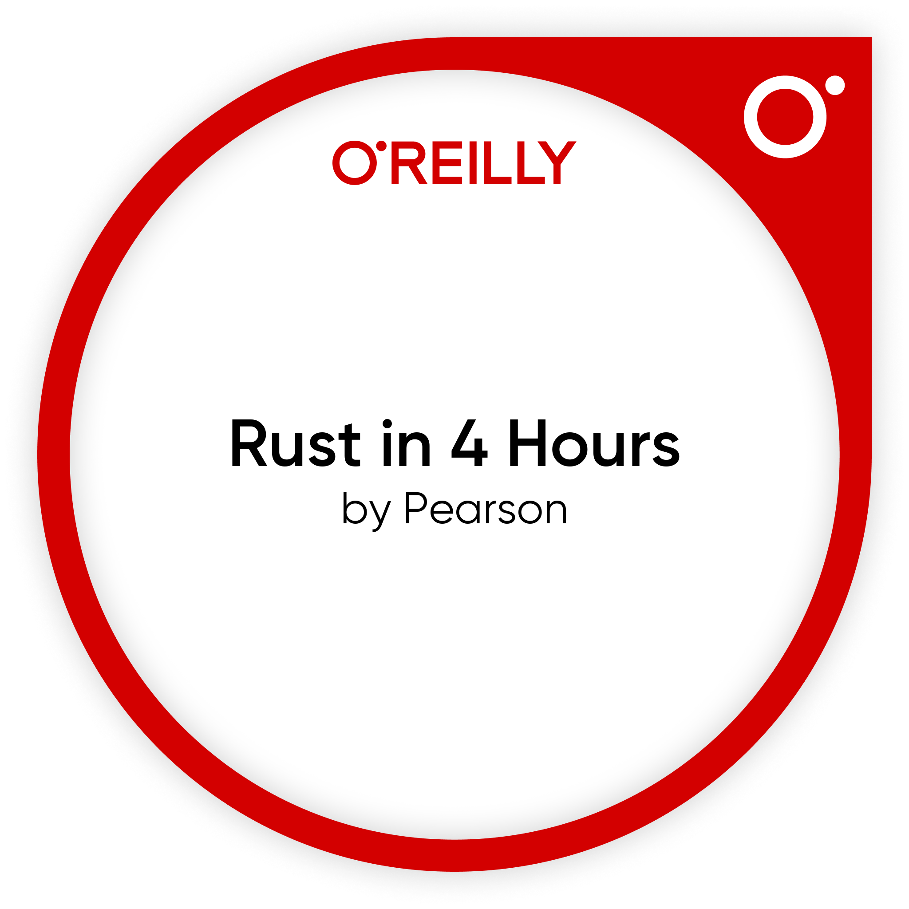

### Hi 👋 I'm iilyak

- 🔭 I’m currently working on CouchDB a no-SQL distributed database
- 🌱 I’m currently learning
  -  - Rust
  -  - Scala
  - Technical leadership
  - Organization leadership
  - Teams Culture

# Scientific interests

- [IBM's Neuro-Symbolic AI](https://research.ibm.com/topics/neuro-symbolic-ai)
- Probabilistic data structures
- Applications of SMT solvers
- Pedagogy
- Zero-trust distributed systems
- Planned economy
- Knowledge management
  - [Zettelkasten method](https://zettelkasten.de/posts/overview/)

# 🛠️ Tools I use

- &nbsp;
- 
-  - `podman` a docker alternative

# Certifications

|Date               | Badge |
|-------------------|-------|
| August 11, 2022   |  |
| October 22, 2021  |  |
| November 28, 2020 |  |
| January 23, 2017  |  |
| January 11, 2024  |  |
| January 11, 2024  |  |
| January 21, 2025  |  |
| January 21, 2025  |  |
| January 21, 2025  |  |

# Books I recommend

Software development

   

  - [Why Programs Fail, 2nd Edition by Andreas Zeller, July 2009](https://learning.oreilly.com/library/view/why-programs-fail/9780123745156/)
  - [Clean Code: A Handbook of Agile Software Craftsmanship by Robert C. Martin, August 2008](https://www.oreilly.com/library/view/clean-code-a/9780136083238/)
  - [Refactoring: Improving the Design of Existing Code by Martin Fowler, November 2018](https://www.oreilly.com/library/view/refactoring-improving-the/9780134757681/)
  - [Purely Functional Data Structures by Chris Okasaki, 1998](https://www.cambridge.org/core/books/purely-functional-data-structures/0409255DA1B48FA731859AC72E34D494)

# Github stats

